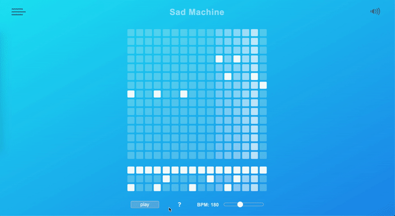

# SquareGroove

[SquareGroove site](https://squaregroove.herokuapp.com/#/)

`SquareGroove` is a programmable audio synthesizer, created by 3 engineers over the span of 5 days. Our goal was to provide an intuitive way for those who have little to no music background to begin creating their own songs. We wanted to give everyone the opportunity to love the process of making music, and hopefully provide a foundation for a future in music learning and creation.

## Technology used:
* React/Redux for frontend rendering
* Express.js for backend MVC framework
* MongoDB and AWS S3 for database

## Features
The grid aesthetic allows for users to program notes by clicking individual squares, pausing and playing the program, switching between different samples in the navigation bar, as well as change the BPM (beats per minute) of the song.
Users can create and save their own grids, as well as listen to other grids in the community.


## Intuitive Interface


The program is immediately understandable. Start by clicking different notes in the grid pattern. The top grid is to program musical notes, with the bottom grid of three rows for programming drums.


When you're ready, click on the play button to hear the song you've made.


Want to make some changes? No need to pause, just click or unclick the notes you want to modify. The clicks will adjust the song seamlessly when it gets to the new notes.


If you want to try a different sound palette for the melodies, click on the hamburger button at the top lefthand side of the page, hover down to the samples section and choose which sample you'd prefer! This navigation bar also has the options to save, login/signup and logout, depending on which buttons you need


If you'd like to save your grid, just change the title at the very top by clicking on it & typing in something new. Then head to the navigation bar and save your grid--remember you have to have an account and log in before you can save!


Once you're done, check out the grid's you've created in the Profile section, or other grids in the community by clicking on the Index button.


You can listen to any of the grids in the community just by clicking on them from the index! Make sure to mess around with the BPM adjuster to set the right pace that you'd like to hear the song at!



And if you forget how to do any of these things, on every grid page there's a questionmark that opens up the instructions modal. This will give you more information on all of the things you can do with the program.


## Code Snippets 
To Create a gradient effect with the grid, different classes are added and removed, depending on which column of notes is being played. The element being passed through the function denotes the column of notes currently playing, and with that you can access prior notes by incrementing the column by -1. Each note leaves a trail of 4 fading notes, which create a gradient effect. At every increment, five columns of notes must have their current classes removed, and be given new classes to update the colorscheme. Below is an example of finding the first trailing column behind the leading notes.

```
temp = ((ele - 1 + 16) % 16);

if (!this.rows[`idx${temp}`]) {
  let col = document.getElementById(`idx${temp}`);
  this.rows[`idx${temp}`] = col;
}
oldCol = this.rows[`idx${temp}`];

for (let i = 0; i < oldCol.children.length; i++) {
  if ((oldCol.children[i].className === "ele rowLit1")) {
    $(oldCol.children[i]).removeClass("rowLit1");
    $(oldCol.children[i]).addClass("rowLit2");
  } else if (oldCol.children[i].className === "bright") {
    $(oldCol.children[i]).removeClass("bright");
    $(oldCol.children[i]).addClass("clicked");
  }
}
```

The BPM Adjuster uses an Event Handler to track movement of an input adjuster tag. BPM is created using a setInterval function, by taking 60,000 (the number of miliseconds in a miniute) and dividing it by the intended BPM. That will give an interval number of miliseconds between each tick. When the input is modified, the bpmChanger function is triggered, creating a new setInterval function with the desired interval. 

```
  this.bpm = e.currentTarget.value;
  clearInterval(this.refreshIntervalId);
  let interval = 60000 / this.bpm;
  this._tick();
  this.refreshIntervalId = setInterval(this._tick, interval);
```

### Planned future features
* Comments
* Likes
